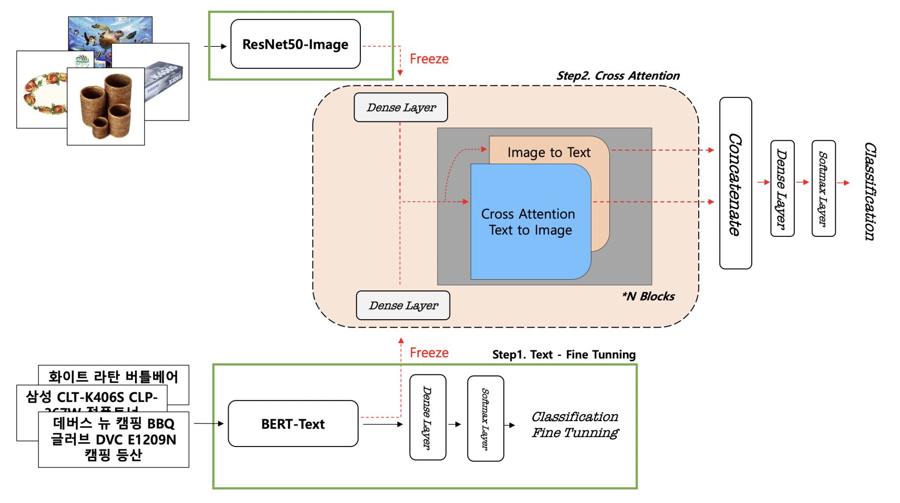
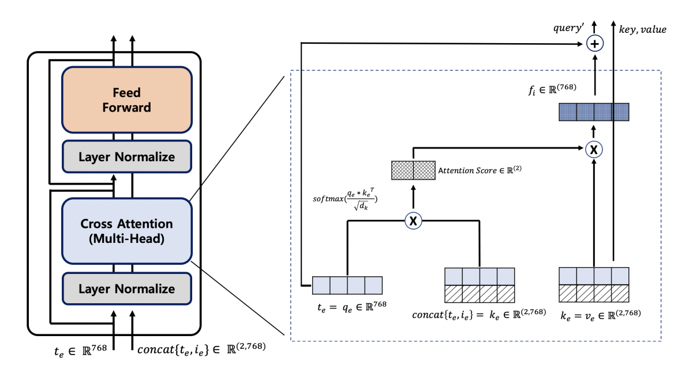
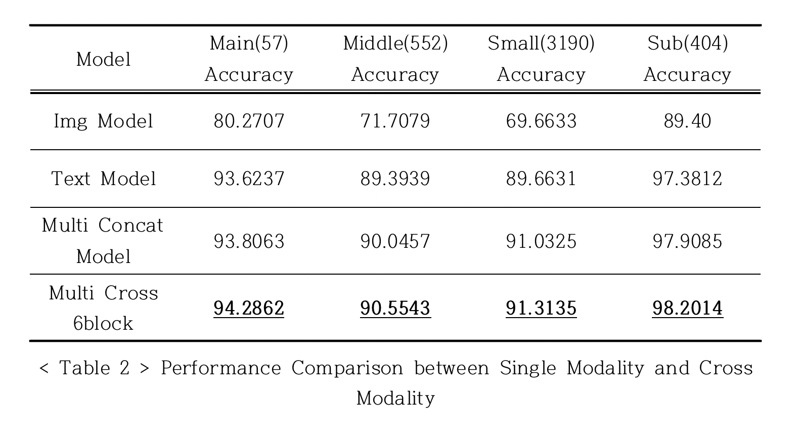
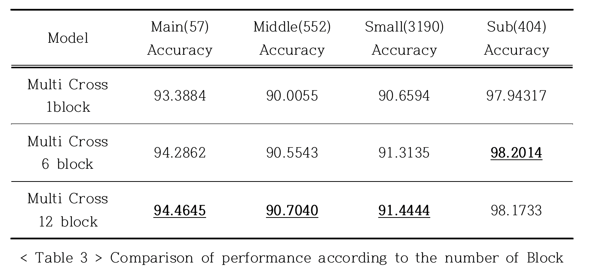
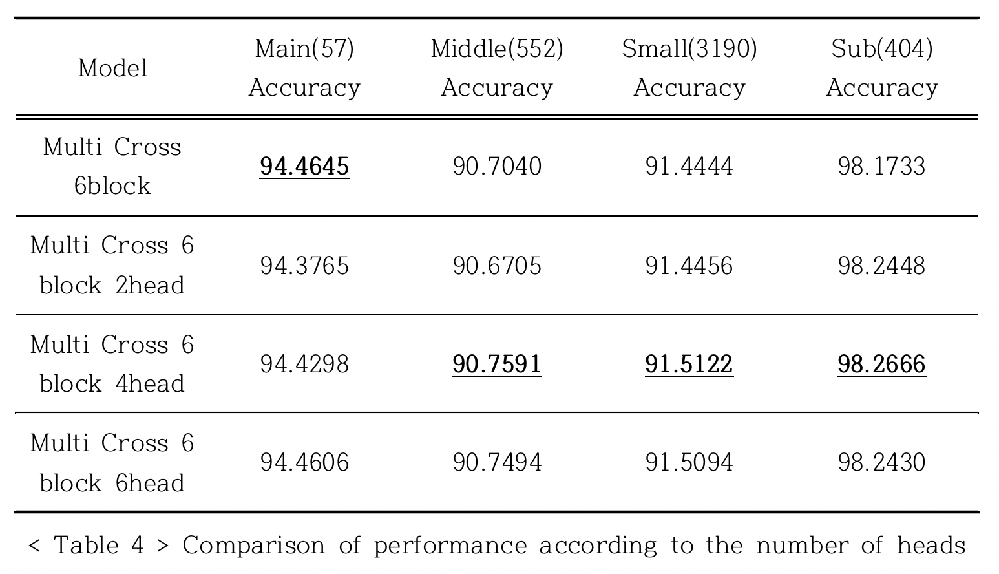

# Multi-Modal-Cross-Attention-Network-for-e-Commerce-Product-Categorization

---

## ABSTRACT

---

As the spread of smart phones and the development of ICT, e-commerce market is rapidly growing. In the case of Naver shopping, a domestic online shopping platform, 20 million products are registered per day, and 5,000 product categories are selective. Retail vendor have difficulties in registering products by classifying them into an appropriate category among 5,000 categories. Categories have an important role for accurate search and correct product exposure. However, in most online shopping platforms, it is difficult to ensure accuracy by classifying categories based on retail vendor’s judgment. Accordingly, number of studies have been conducted to suggest machine learning and deep learning models for more accurate and objective product classification. However, most studies have been conducted on a single modality such as text, and studies on multi-modality have a limitation which interaction between modalities are not reflected. In addition, online product data is difficult to classify because the quality of the data is poor and categories are extremely asymmetric. Therefore, maximize the use of intermodality information is important. In this study, we propose a Cross Attention Block that reflects the interaction between independent modalities.

---

### Purpose of Model

This model get product name(text) and image as input to classify Main, Middle, Small, Sub category which has 57, 552, 3190, 404 categories respectively.
 
Preview : Structure of the model  
  

> Firstly, FineTunning Train is needed for both Single Image Model and Text Model.
> Secondly, Freeze all the weights of single Modality.
> Thirdly, Retrain with Cross Attention Part.

 
 

How to refer between two different modalities.  
  

> Cross Attention Part : Text refer itself and image at the same time. At this image t means text which is also q(query) and key and value would be bounded text and image. Get cross attention score between query and key by

 $$ softmax(q_e*k_e / sqrt(d_k)) $$ 

> Multiply cross attention score on value to emphasize and de-emphasize tensors. Finaly get residual to make deep layers.

### Training Process:

train.py holds all the training process.
 

#### Step 1 : To train text only modal

 

`python train.py --modality text --logging_fn ./saved/text/text_finetuning.log --model_fn ./saved/text/text_finetuning.pth`  

> Since saved model is quite large, I except trained models from this repository.

 

#### Step 2 : To train image only modal

> In this case We do not need finetuned model since encoded tensor image data were given from ResNet 50

 

`python train.py --modality img --logging_fn ./saved/img/img_ffn.log --model_fn ./saved/img/img_finetuning.pth`  

 

#### Step 3 : To train multi-modal

To train multi modal(finetuned models are required both image and text but in this case encoded tensor image data were given from ResNet50)
 

`python train.py --modality both --multiModal_type cross --logging_fn ./saved/multi/full/multi_cross_6block.log --load_model_path ./saved/text/text.06.-0.93-0.88-.0.68-0.09-.pth`

---

### Results

#### Comparison 1 : Single VS Multi modal

I got better performance on Cross Multi Modality compare to single and multi concat modality.
 

 

#### Comparison 2 : Number of Blocks

#### Comparison 3 : Number of Heads

---

### Train-Tree

├── README.md
├── data
│   ├── bpe
│   ├── mecab
│   ├── train_df_negOne_moreColumns
│   └── validation.csv
├── img_data
├── inference.py
├── model
│   ├── multimodel.py
│   └── trainer.py
├── process
│   ├── bert_dataset.py
│   ├── bert_dataset1.py
│   ├── bert_trainer.py
│   ├── data_loader.py
│   └── utils.py
├── train.py
├── trainer.py
└── trainer_valid.py

#### Data

├── saved
│   ├── img
│   │   └── img_ffn.log
│   ├── multi
│   │   ├── full
│   │   │   └── multi_cross_6block.log
│   │   ├── multi_cross_12block.log
│   │   ├── multi_cross_2block.log
│   │   ├── ...
│   │   ├── multi_simple_concat.log
│   │   ├── multi_simple_concat_0530
│   │   └── old
│   │   └── multi_simple_concat_past_old.log
│   └── text
│   ├── multi_simple_concat.log
│   └── text_finetuning.log
├── predict
│   ├── dev
│   │   ├── img
│   │   │   └── img_config
│   │   ├── multi
│   │   │   ├── all_multi_6block_6th_predict.log
│   │   │   ├── all_multi_6block_config
│   │   │   ├── dev_multi_cross_12block_config
│   │   │   ├── dev_multi_cross_2block_config
│   │   │   ├── dev_multi_cross_6block_2head_config
│   │   │   ├── dev_multi_cross_6block_4head_config
│   │   │   ├── dev_multi_cross_6block_6head_config
│   │   │   ├── dev_multi_cross_6block_config
│   │   │   ├── dev_multi_simple_config
│   │   │   ├── multi_cross_12block_6th_predict.log
│   │   │   ├── multi_cross_2block_6th_predict.log
│   │   │   ├── multi_cross_6block_2head_6th_predict.log
│   │   │   ├── multi_cross_6block_4head_6th_predict.log
│   │   │   ├── multi_cross_6block_6head_6th_predict.log
│   │   │   ├── multi_cross_6block_6th_predict.log
│   │   │   ├── multi_simple_6th_predict.log
│   │   │   └── simple_6th_predict
│   │   └── text
│   │   ├── text_config
│   │   ├── text_predict.csv
│   │   └── text_predict.log
│   ├── new
│   │   ├── img
│   │   │   ├── img_config
│   │   │   └── img_predict.log
│   │   ├── multi
│   │   │   ├── cross_12block_1head.log
│   │   │   ├── cross_12block_1head_config
│   │   │   ├── cross_1block_1head.log
│   │   │   ├── cross_1block_1head_config
│   │   │   ├── cross_1head.log
│   │   │   ├── cross_6block_1head.log
│   │   │   ├── cross_6block_1head_config
│   │   │   ├── cross_6block_2head.log
│   │   │   ├── cross_6block_2head_config
│   │   │   ├── cross_6block_4head.log
│   │   │   ├── cross_6block_4head_config
│   │   │   ├── cross_6block_6head.log
│   │   │   ├── cross_6block_6head_config
│   │   │   ├── cross_config
│   │   │   ├── simple_concat.log
│   │   │   └── simple_concat_config
│   │   └── text
│   │   ├── text_config
│   │   └── text_predict.log
│   └── valid
│   ├── img
│   │   ├── img_config
│   │   └── img_predict.log
│   ├── multi
│   │   ├── cross_12block_1head.log
│   │   ├── cross_12block_1head_config
│   │   ├── ...
│   │   └── multi_simple_predict.log
│   └── text
│   ├── text_config
│   └── text_predict.log

---
